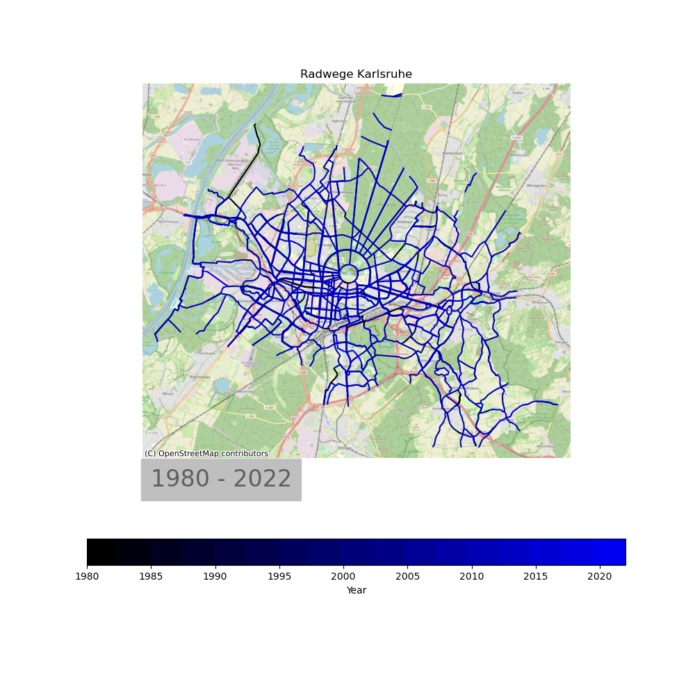

# BikeLanes Karlsruhe

Geojson has Karlsruhe bike lanes built or defined since 1980 (big gap from 1980 to 2007).

Create map video with evolution of lanes.

Total length appears to be quite large, needs checking/confirmation

## Demo Video

[Demo](https://cloud.ok-lab-karlsruhe.de/index.php/s/4LLJN93jZQwEN9b)

## Issues

 * Fixed: OSM Contributors copyright text hidden by info text
 * Number of tracks and total length suspicious. Check with data provider
    * Removing duplicates (geometry based) helps, but maybe not sufficient

  
 

