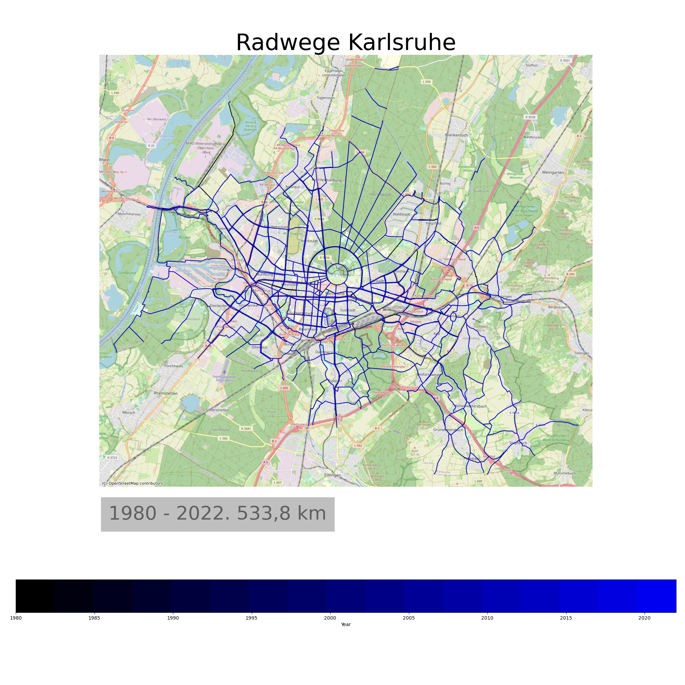

# BikeLanes Karlsruhe

Geojson has Karlsruhe bike lanes built or defined since 1980 (big gap from 1980 to 2007).

Create map video with evolution of lanes.

## Demo Video

[Demo](https://cloud.ok-lab-karlsruhe.de/index.php/s/4LLJN93jZQwEN9b)

## Issues

 * Fixed: OSM Contributors copyright text hidden by info text
 * Number of tracks and total length suspicious. Check with data provider
    * Removing duplicates (geometry based) helps, but maybe not sufficient
    * According to *Nachaltigkeitsbericht* the total length is 531km in 2020. In 2012 
    a bulk update of the database occured, which explains the jump in length in that year.
    Result seems to be in-line with the official values. 

  
 

